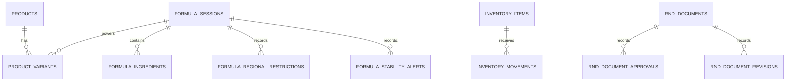

# Giavico monolith data relationships

All feature areas use the single `giavico` MySQL schema. Package and table
boundaries still separate the internal domains.

Formula ingredients and inventory items continue to integrate through the
`rawMaterialKey` application contract. No database foreign key is introduced
between those domains, so inventory records can be managed independently.

R&D documents may store a formula UUID as an optional reference. It is likewise
an application-level link rather than a cross-domain foreign key.
