# MySQL Schema and Relationships

Generated from local MySQL on 2026-06-17T14:58:23.014441.

Schemas covered: `giavico_formula`, `giavico_inventory`, `giavico_chat`, `giavico_formulation`.

## Relationship Diagram

```mermaid
erDiagram
  giavico_formula__formula_ingredients {
    binary_16 id PK
    decimal_14_4 cost_projection
    double mass_percentage
    varchar_160 raw_material_key
    binary_16 formula_session_id FK
  }
  giavico_formula__formula_regional_restrictions {
    binary_16 formula_session_id FK
    varchar_500 restriction_text
  }
  giavico_formula__formula_sessions {
    binary_16 id PK
    bit_1 acidified
    varchar_160 baselinebom
    datetime_6 created_at
    tinytext customer_specification
    varchar_240 market_destination
    varchar_160 name
    varchar_240 production_area
    varchar_500 summary
    double target_brix
    longtext variance_analysis
  }
  giavico_formula__formula_stability_alerts {
    binary_16 formula_session_id FK
    varchar_1000 alert_text
  }
  giavico_formula__product_variants {
    binary_16 id PK
    tinytext customer_specification
    datetime_6 effective_from
    datetime_6 effective_to
    varchar_240 market_destination
    varchar_240 production_area
    longtext regulatory_snapshot
    binary_16 formula_session_id FK
    binary_16 product_id FK
  }
  giavico_formula__products {
    binary_16 id PK
    varchar_160 drink_name
  }
  giavico_inventory__inventory_items {
    binary_16 id PK
    varchar_120 category
    datetime_6 created_at
    date expiration_date
    varchar_120 lot_number
    varchar_240 material_name
    decimal_18_4 quantity_on_hand
    varchar_160 raw_material_key
    decimal_18_4 reorder_point
    varchar_32 status
    varchar_180 supplier_name
    decimal_18_4 unit_cost
    varchar_32 unit_of_measure
    datetime_6 updated_at
    varchar_160 warehouse_location
  }
  giavico_inventory__inventory_movements {
    binary_16 id PK
    datetime_6 created_at
    varchar_32 movement_type
    varchar_120 performed_by
    decimal_18_4 quantity_delta
    varchar_1000 reason
    varchar_160 reference_id
    varchar_80 reference_type
    decimal_18_4 resulting_quantity
    binary_16 inventory_item_id FK
  }
  giavico_chat__chat_messages {
    binary_16 id PK
    longtext content
    datetime_6 created_at
    varchar_24 role
  }
  giavico_formulation__chat_messages {
    binary_16 id PK
    longtext content
    datetime_6 created_at
    varchar_24 role
  }
  giavico_formulation__formula_ingredients {
    binary_16 id PK
    decimal_14_4 cost_projection
    double mass_percentage
    varchar_160 raw_material_key
    binary_16 formula_session_id FK
  }
  giavico_formulation__formula_regional_restrictions {
    binary_16 formula_session_id FK
    varchar_500 restriction_text
  }
  giavico_formulation__formula_sessions {
    binary_16 id PK
    bit_1 acidified
    varchar_160 baselinebom
    datetime_6 created_at
    tinytext customer_specification
    varchar_240 market_destination
    varchar_160 name
    varchar_240 production_area
    varchar_500 summary
    double target_brix
    longtext variance_analysis
  }
  giavico_formulation__formula_stability_alerts {
    binary_16 formula_session_id FK
    varchar_1000 alert_text
  }
  giavico_formulation__product_variants {
    binary_16 id PK
    tinytext customer_specification
    datetime_6 effective_from
    datetime_6 effective_to
    varchar_240 market_destination
    varchar_240 production_area
    longtext regulatory_snapshot
    binary_16 formula_session_id FK
    binary_16 product_id FK
  }
  giavico_formulation__products {
    binary_16 id PK
    varchar_160 drink_name
  }
  giavico_formula__formula_sessions ||--o{ giavico_formula__formula_ingredients : "formula_session_id"
  giavico_formula__formula_sessions ||--o{ giavico_formula__formula_regional_restrictions : "formula_session_id"
  giavico_formula__formula_sessions ||--o{ giavico_formula__formula_stability_alerts : "formula_session_id"
  giavico_formula__products ||--o{ giavico_formula__product_variants : "product_id"
  giavico_formula__formula_sessions ||--o{ giavico_formula__product_variants : "formula_session_id"
  giavico_inventory__inventory_items ||--o{ giavico_inventory__inventory_movements : "inventory_item_id"
  giavico_formulation__formula_sessions ||--o{ giavico_formulation__formula_ingredients : "formula_session_id"
  giavico_formulation__formula_sessions ||--o{ giavico_formulation__formula_regional_restrictions : "formula_session_id"
  giavico_formulation__formula_sessions ||--o{ giavico_formulation__formula_stability_alerts : "formula_session_id"
  giavico_formulation__products ||--o{ giavico_formulation__product_variants : "product_id"
  giavico_formulation__formula_sessions ||--o{ giavico_formulation__product_variants : "formula_session_id"
```

## Tables

### `giavico_formula`

#### `formula_ingredients`

| Column | Type | Null | Key | Default | Extra |
| --- | --- | --- | --- | --- | --- |
| `id` | `binary(16)` | NO | PRI |  |  |
| `cost_projection` | `decimal(14,4)` | NO |  |  |  |
| `mass_percentage` | `double` | NO |  |  |  |
| `raw_material_key` | `varchar(160)` | NO |  |  |  |
| `formula_session_id` | `binary(16)` | NO | MUL |  |  |

#### `formula_regional_restrictions`

| Column | Type | Null | Key | Default | Extra |
| --- | --- | --- | --- | --- | --- |
| `formula_session_id` | `binary(16)` | NO | MUL |  |  |
| `restriction_text` | `varchar(500)` | YES |  |  |  |

#### `formula_sessions`

| Column | Type | Null | Key | Default | Extra |
| --- | --- | --- | --- | --- | --- |
| `id` | `binary(16)` | NO | PRI |  |  |
| `acidified` | `bit(1)` | NO |  |  |  |
| `baselinebom` | `varchar(160)` | YES |  |  |  |
| `created_at` | `datetime(6)` | NO |  |  |  |
| `customer_specification` | `tinytext` | NO |  |  |  |
| `market_destination` | `varchar(240)` | NO |  |  |  |
| `name` | `varchar(160)` | NO |  |  |  |
| `production_area` | `varchar(240)` | NO |  |  |  |
| `summary` | `varchar(500)` | NO |  |  |  |
| `target_brix` | `double` | NO |  |  |  |
| `variance_analysis` | `longtext` | YES |  |  |  |

#### `formula_stability_alerts`

| Column | Type | Null | Key | Default | Extra |
| --- | --- | --- | --- | --- | --- |
| `formula_session_id` | `binary(16)` | NO | MUL |  |  |
| `alert_text` | `varchar(1000)` | YES |  |  |  |

#### `product_variants`

| Column | Type | Null | Key | Default | Extra |
| --- | --- | --- | --- | --- | --- |
| `id` | `binary(16)` | NO | PRI |  |  |
| `customer_specification` | `tinytext` | NO |  |  |  |
| `effective_from` | `datetime(6)` | NO |  |  |  |
| `effective_to` | `datetime(6)` | YES |  |  |  |
| `market_destination` | `varchar(240)` | NO |  |  |  |
| `production_area` | `varchar(240)` | NO |  |  |  |
| `regulatory_snapshot` | `longtext` | YES |  |  |  |
| `formula_session_id` | `binary(16)` | YES | MUL |  |  |
| `product_id` | `binary(16)` | NO | MUL |  |  |

#### `products`

| Column | Type | Null | Key | Default | Extra |
| --- | --- | --- | --- | --- | --- |
| `id` | `binary(16)` | NO | PRI |  |  |
| `drink_name` | `varchar(160)` | NO |  |  |  |

### `giavico_inventory`

#### `inventory_items`

| Column | Type | Null | Key | Default | Extra |
| --- | --- | --- | --- | --- | --- |
| `id` | `binary(16)` | NO | PRI |  |  |
| `category` | `varchar(120)` | NO |  |  |  |
| `created_at` | `datetime(6)` | NO |  |  |  |
| `expiration_date` | `date` | YES |  |  |  |
| `lot_number` | `varchar(120)` | YES |  |  |  |
| `material_name` | `varchar(240)` | NO |  |  |  |
| `quantity_on_hand` | `decimal(18,4)` | NO |  |  |  |
| `raw_material_key` | `varchar(160)` | NO | UNI |  |  |
| `reorder_point` | `decimal(18,4)` | NO |  |  |  |
| `status` | `varchar(32)` | NO |  |  |  |
| `supplier_name` | `varchar(180)` | YES |  |  |  |
| `unit_cost` | `decimal(18,4)` | NO |  |  |  |
| `unit_of_measure` | `varchar(32)` | NO |  |  |  |
| `updated_at` | `datetime(6)` | NO |  |  |  |
| `warehouse_location` | `varchar(160)` | NO |  |  |  |

#### `inventory_movements`

| Column | Type | Null | Key | Default | Extra |
| --- | --- | --- | --- | --- | --- |
| `id` | `binary(16)` | NO | PRI |  |  |
| `created_at` | `datetime(6)` | NO |  |  |  |
| `movement_type` | `varchar(32)` | NO |  |  |  |
| `performed_by` | `varchar(120)` | YES |  |  |  |
| `quantity_delta` | `decimal(18,4)` | NO |  |  |  |
| `reason` | `varchar(1000)` | NO |  |  |  |
| `reference_id` | `varchar(160)` | YES |  |  |  |
| `reference_type` | `varchar(80)` | YES |  |  |  |
| `resulting_quantity` | `decimal(18,4)` | NO |  |  |  |
| `inventory_item_id` | `binary(16)` | NO | MUL |  |  |

### `giavico_chat`

#### `chat_messages`

| Column | Type | Null | Key | Default | Extra |
| --- | --- | --- | --- | --- | --- |
| `id` | `binary(16)` | NO | PRI |  |  |
| `content` | `longtext` | NO |  |  |  |
| `created_at` | `datetime(6)` | NO |  |  |  |
| `role` | `varchar(24)` | NO |  |  |  |

### `giavico_formulation`

#### `chat_messages`

| Column | Type | Null | Key | Default | Extra |
| --- | --- | --- | --- | --- | --- |
| `id` | `binary(16)` | NO | PRI |  |  |
| `content` | `longtext` | NO |  |  |  |
| `created_at` | `datetime(6)` | NO |  |  |  |
| `role` | `varchar(24)` | NO |  |  |  |

#### `formula_ingredients`

| Column | Type | Null | Key | Default | Extra |
| --- | --- | --- | --- | --- | --- |
| `id` | `binary(16)` | NO | PRI |  |  |
| `cost_projection` | `decimal(14,4)` | NO |  |  |  |
| `mass_percentage` | `double` | NO |  |  |  |
| `raw_material_key` | `varchar(160)` | NO |  |  |  |
| `formula_session_id` | `binary(16)` | NO | MUL |  |  |

#### `formula_regional_restrictions`

| Column | Type | Null | Key | Default | Extra |
| --- | --- | --- | --- | --- | --- |
| `formula_session_id` | `binary(16)` | NO | MUL |  |  |
| `restriction_text` | `varchar(500)` | YES |  |  |  |

#### `formula_sessions`

| Column | Type | Null | Key | Default | Extra |
| --- | --- | --- | --- | --- | --- |
| `id` | `binary(16)` | NO | PRI |  |  |
| `acidified` | `bit(1)` | NO |  |  |  |
| `baselinebom` | `varchar(160)` | YES |  |  |  |
| `created_at` | `datetime(6)` | NO |  |  |  |
| `customer_specification` | `tinytext` | NO |  |  |  |
| `market_destination` | `varchar(240)` | NO |  |  |  |
| `name` | `varchar(160)` | NO |  |  |  |
| `production_area` | `varchar(240)` | NO |  |  |  |
| `summary` | `varchar(500)` | NO |  |  |  |
| `target_brix` | `double` | NO |  |  |  |
| `variance_analysis` | `longtext` | YES |  |  |  |

#### `formula_stability_alerts`

| Column | Type | Null | Key | Default | Extra |
| --- | --- | --- | --- | --- | --- |
| `formula_session_id` | `binary(16)` | NO | MUL |  |  |
| `alert_text` | `varchar(1000)` | YES |  |  |  |

#### `product_variants`

| Column | Type | Null | Key | Default | Extra |
| --- | --- | --- | --- | --- | --- |
| `id` | `binary(16)` | NO | PRI |  |  |
| `customer_specification` | `tinytext` | NO |  |  |  |
| `effective_from` | `datetime(6)` | NO |  |  |  |
| `effective_to` | `datetime(6)` | YES |  |  |  |
| `market_destination` | `varchar(240)` | NO |  |  |  |
| `production_area` | `varchar(240)` | NO |  |  |  |
| `regulatory_snapshot` | `longtext` | YES |  |  |  |
| `formula_session_id` | `binary(16)` | YES | MUL |  |  |
| `product_id` | `binary(16)` | NO | MUL |  |  |

#### `products`

| Column | Type | Null | Key | Default | Extra |
| --- | --- | --- | --- | --- | --- |
| `id` | `binary(16)` | NO | PRI |  |  |
| `drink_name` | `varchar(160)` | NO |  |  |  |

## Foreign Keys

| Constraint | From | To |
| --- | --- | --- |
| `FK2cfe27li3qb5o8n0ewcsv8w9m` | `giavico_formula.formula_ingredients.formula_session_id` | `giavico_formula.formula_sessions.id` |
| `FK941jx78aoni2oic3d9vp7yg6s` | `giavico_formula.formula_regional_restrictions.formula_session_id` | `giavico_formula.formula_sessions.id` |
| `FKl1uurumfjebuwjglns44ej9oy` | `giavico_formula.formula_stability_alerts.formula_session_id` | `giavico_formula.formula_sessions.id` |
| `FKosqitn4s405cynmhb87lkvuau` | `giavico_formula.product_variants.product_id` | `giavico_formula.products.id` |
| `FKr4dt1v4bgk01pnp8jl5jimfq` | `giavico_formula.product_variants.formula_session_id` | `giavico_formula.formula_sessions.id` |
| `FK5g2urco9ofj37nh4x8v01fdxv` | `giavico_inventory.inventory_movements.inventory_item_id` | `giavico_inventory.inventory_items.id` |
| `FK2cfe27li3qb5o8n0ewcsv8w9m` | `giavico_formulation.formula_ingredients.formula_session_id` | `giavico_formulation.formula_sessions.id` |
| `FK941jx78aoni2oic3d9vp7yg6s` | `giavico_formulation.formula_regional_restrictions.formula_session_id` | `giavico_formulation.formula_sessions.id` |
| `FKl1uurumfjebuwjglns44ej9oy` | `giavico_formulation.formula_stability_alerts.formula_session_id` | `giavico_formulation.formula_sessions.id` |
| `FKosqitn4s405cynmhb87lkvuau` | `giavico_formulation.product_variants.product_id` | `giavico_formulation.products.id` |
| `FKr4dt1v4bgk01pnp8jl5jimfq` | `giavico_formulation.product_variants.formula_session_id` | `giavico_formulation.formula_sessions.id` |
